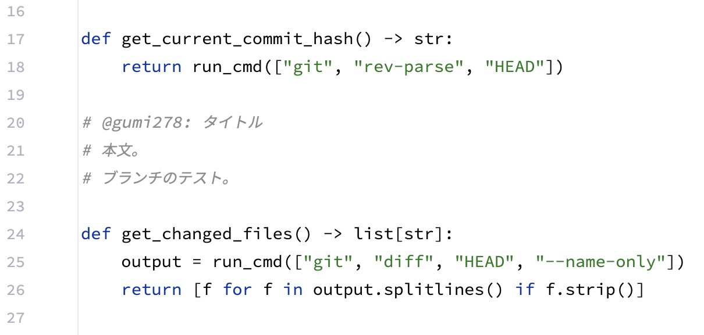
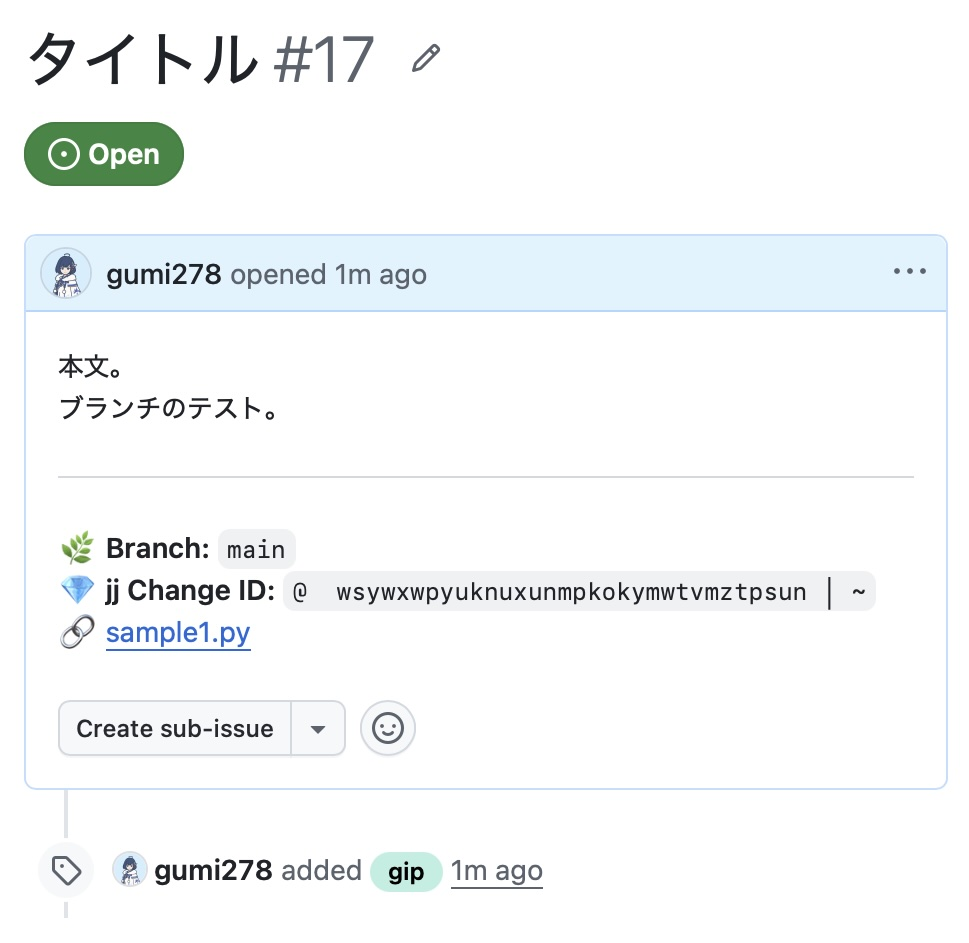
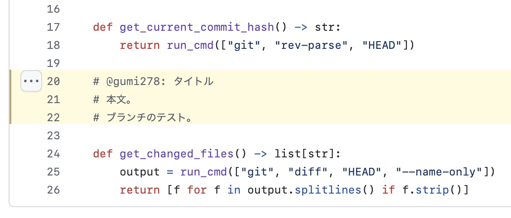

# git-intent-picker (gip)

[English](README.md) | [日本語](README.ja.md)

ソースコードに書き込んだ「マーカーコメント」を拾ってくるCLIツールです。

AI駆動開発（AIエージェントによる自動実装など）において、「AIが生成したコード」と「人間の意図コメント」を分離し、コミット履歴をクリーンに保つための「意図のサイドカー（Sidecar）」として機能します。

現時点の実装は、Pythonコードに記述したマーカーコメントを抽出し、GitHubへ半自動的にIssue化する挙動となっています。

> [!NOTE]
> このREADMEも基本的にAIエージェントに作らせています（よってちょっとポエムっぽいところがある）。
> 
> このツールは、AIエージェント施策の１つとして考案したツールです。
>
> AIエージェントにコーディングを任せると、意図的に残しているコメントを勝手に消してきます。この所作にいくつか対応を考えたのですが、効果的な解決を見つけることができませんでした。それで私は *AIエージェントによってソースコードの存在意義が変わり、私は制御を半分近く失った後にいる* と解釈し、思考方向を変えました。
>
> AIエージェントの領域を認め、確率論支配の排除ではなく共存するために開発者の意図を移管する必要があると考え、git履歴化して確定しつつ、参照特性と機能拡張の両方を満たす方法として手っ取り早いgithub issueを使うことにしました。





## ✨ 特徴

* **安全なRead-Only設計**: ファイルを自動で削除・復元（`git restore`）するような破壊的変更は一切行いません。抽出後は、任意のタイミングでコミットしてクリーンアップできます。
* **1意図 = 1 Issue**: 抽出されたマーカーコメントのブロックごとに、独立したGitHub Issueを自動で起票します。
* **クリーンなテキスト出力**: `gh` コマンドを通じて起票されるIssueは、Pythonのコメント記号（`#`）や不要なインデントが取り除かれたプレーンテキストとして記録されます。
* **HEADコミットの完璧な紐付け**: 直近のコミット（HEAD）のハッシュと変更行を解析し、Issue本文に対象ファイルと**該当する行番号**（例: `#L12-L15`）のパーマリンクとして自動的に刻印します。
* **タイトルの自動生成**: マーカーコメントの1行目からプレフィックスを取り除き、自動的にIssueのタイトルを生成します。

## 📦 前提条件

このツールは以下のコマンドと設定に依存しています。

* Python 3.x
* Git
* GitHub CLI (`gh`) ※事前に `gh auth login` で認証を済ませてください。
* **【重要】GitHubリポジトリの設定**: 本ツールは作成するIssueに自動で `gip` というラベルを付与します。**事前にGitHubリポジトリ上で `gip` という名前のラベルを作成しておいてください。**（ラベルが存在しないとエラーで処理が中断します）。

## 🚀 インストール

MacやLinux環境では、HomebrewのカスタムTapを利用したインストールを推奨しています。
必要な依存関係（`gh`, `python3`）も自動的に解決されます。

```bash
brew install gumi278/tap/gip
```

インストール完了後、ターミナルで `gip` コマンドがどこからでも使えるようになります（※事前に `gh auth login` による認証が必要です）。

### 最新版の取得（手動インストール）

常に最新のソースコードを使用したい場合や、Homebrew環境がない場合は、リポジトリをローカルにクローンして使用してください。
プログラムのエントリーポイントは `src/gip/main.py` です。

```bash
git clone https://github.com/gumi278/git-intent-picker.git

# 実行例
# python3 git-intent-picker/src/gip/main.py
```

## 💻 使い方

### 1. マーカーコメントの書き方

作業ツリーの `.py` ファイルに、特定のプレフィックス（`# @あなたの名前`）で始まるコメントを記述し、**コミットします**。

* 必ず行の1文字目を `#` で始めてください（左側にインデントがあっても構いません）。
* プレフィックスに使用する「名前」は、`git config user.name` の設定値と合わせることを推奨します（コマンド実行時のオプション指定が不要になるため）。
* 名前の直後は空白、コロン（`:`）、または改行にしてください（誤検知防止のため）。

```python
    def calculate_total():
        # @taro: 依存関係の注入について
        # ここでは外部APIを直接叩かず、DIを用いて
        # テスト容易性を担保する設計にしました。
        pass
```

### 1.1 勘違いしやすいポイント

* **直前のコミット（HEAD）への変更にのみ反応します**

  本ツールは、`git diff HEAD~1 HEAD` を用いて「直近のコミットで追加・変更された行」を起点としてマーカーコメントを抽出します。そのため、**過去のコミットからずっと存在している既存のマーカーコメントは再抽出されません**。
  （※過去のマーカーコメントを再度Issue化したい場合は、ブロック内のどこかの行を編集・追記して新しい差分を生じさせる必要があります）。


* **マーカーコメントのブロックは、行コメントが途切れるまでです**

  途中で空行が入ったり、複数行文字列（`"""` によるdocstringなど）のような書き方には対応していません。連続する行コメント（`#`）が途切れた箇所までを、ひとつのマーカーコメントのブロックとして機械的に認識します。


* **IssueのパーマリンクはPushするまで404になります**

  `gip` は現在ローカルにある最新のコミットハッシュ（HEAD）を使ってパーマリンクを生成します。そのため、起票直後のIssueのリンクは、そのコミットをリモート（GitHub）へ `git push` するまで「404 Not Found」になります。


* **Pythonコードにしか反応しません**

  マーカーコメントの取り扱いを多言語展開すると複雑になるため、現在はPythonファイル（`.py`）限定としています。今後、他言語へ対応する可能性があります。


* **コマンド実行の位置が重要です**

  必ず対象となるGitリポジトリ配下のディレクトリに移動してから実行してください。GitHub Issueへのアクセス先は、環境設定やGitの設定から取得します。


* **ブランチは目安です**

  `gip` が特殊な処理をして履歴にブランチを保存しているのではありません。コマンド実行時のブランチ名をテキストで残しているに過ぎません。


### 2. コマンドの実行

マーカーコメントを含んだ状態でコミットを作成したら、ターミナルから以下のコマンドを実行します。
デフォルトでは、Gitの設定（`git config user.name`）から自動的に名前を取得して抽出対象とします。

```bash
gip
```

もしGitの設定とは異なる名前で抽出したい場合は、`--author` オプションで明示的に指定することも可能です。

```bash
gip --author "taro"
```

### 3. 起票先リポジトリの制御（環境変数）

フォークしたリポジトリ（`origin`）で作業しつつ、Issueの起票先は本家（`upstream`）にしたい場合など、環境変数 `GIP_ISSUE_REMOTE` を設定することでIssueの送信先リモートを制御できます。

```bash
export GIP_ISSUE_REMOTE=upstream
```

* 未定義、または空文字の場合はデフォルトで `origin` が使用されます。
* パーマリンク（コードへのリンク）は常にコードの実体がある `origin` をベースに生成されるため、リポジトリを横断して起票してもリンク切れにはなりません。
* `direnv` などを利用して、プロジェクト（ディレクトリ）ごとに `.envrc` へ環境変数を記述しておく運用を想定しています。

## 🔄 理想的なワークフロー

`git-intent-picker` を用いた、コードと意図を分離する最も美しく自然なトランザクション（作業の流れ）です。

1. **コードと意図の記述＆コミット (HEAD確定)**

  実装したコードと合わせて、IDE上で `.py` ファイルに `# @名前:` で意図（マーカーコメント）を書き込み、すべてを一緒にコミットします。
（例: `git commit -m "feat: implement logic with intent"`）


2. **抽出と起票**

  `gip` を実行します。直近のコミットの差分からマーカーコメントが抽出され、確定したコミットハッシュと行番号を伴った完璧なパーマリンクと共にGitHub Issueが作成されます。


3. **リモートへのPush（リンクの有効化）**

  `git push` を実行し、コミットをリモートリポジトリに反映させます。これにより、起票されたIssueのパーマリンクが有効になります。

4. **意図の消去 (Sidecarの切り離し)**

  Issueが起票されたらソースコード上のマーカーコメントは不要になります。IDEでマーカーコメントを削除し、それだけを独立したコミットとして積み重ねます。
  （例: `git commit -m "remove: gip marker comments"`）
  *(※この作業はあなたが手動で行っても良いですし、AIエージェントが次にコードを編集する際に文脈を読んで勝手に消してくれても構いません)*。

このワークフローにより、「コード上に意図が存在した確固たる過去の記録（スナップショット）」をIssueとして残しつつ、未来のコミット履歴からは不要なコメントノイズを完全に消し去ることができます。

## ⚙️ 制限事項

* 現在のバージョンでは、抽出対象のファイルは `.py` 拡張子のファイルのみに限定されています。

### 🤺 Jujutsu (jj) ユーザーへ：流動的な歴史と「封蝋」の作法

`gip` は、特定のGitコミットハッシュが「絶対不変（Immutable）である」という前提のもとにパーマリンクを生成します。そのため、歴史を息をするように書き換え、ハッシュを自動で再生成し続ける **Jujutsu (jj)** とは、根本的にアーキテクチャの相性が最悪です。

しかし、`gip` は `jj` 環境下で実行されたことを検知すると、GitHubのパーマリンクに加えて、Jujutsuの不変の識別子である **Change ID** をIssueのフッターに自動で刻印します。（例: `💎 jj Change ID: qzvqwsxv...`）

`jj` 環境下でGitHub上のパーマリンクをリンク切れ（404）させず、正しく「意図のサイドカー」として機能させるには、以下の運用作法が求められます。

#### 📜 The Wax Seal（封蝋）運用ルール
Jujutsuユーザーにとって、`gip` を撃つ行為は「手紙に封蝋（シーリングワックス）を垂らす儀式」です。

1. **歴史をこねる:** `jj` の強力な機能を使い、コードを自由に書き換え、リベースし、Changeを完全に仕上げます。
2. **意図を添える:** 「よし、これで完成だ」と決まった最後の瞬間に、エディタでマーカーコメントを打ち込みます。
3. **封印 (gip):** `gip` を実行します。この瞬間の不安定なGitハッシュとChange IDがIssueに刻まれます。
4. **即座に投函する:** 封蝋が乾く前（他の変更を加えてハッシュが揮発する前）に、即座に `jj git push` を撃ち、リモートの `.git` データベースにそのハッシュを「絶対不変の石」として定着させます。

#### ⚠️ リンク切れは「制御不足」のエンブレム

もしあなたがこのルールを破り、`gip` で封印した直後に「やっぱりここ直そう」とローカルでコードを弄ってしまった場合。裏側でGitハッシュが再生成されるため、その後Pushしても **GitHub上のパーマリンクは永遠に 404 Not Found となります。**

これはツールの欠陥ではなく、**「封蝋をした手紙を、投函前にわざわざ破って書き直した」という、あなたのシステム制御の甘さ（ダサさ）の証明**として Issue に残り続けます。

ただし、リンク切れを起こすというペナルティを負ったとしても、Issueには `Change ID` が残されています。未来の開発者（あるいは未来のあなた自身）は、ローカル環境で `jj show <Change ID>` を実行することで、当時の意図と歴史の変遷を完全に復元することが可能です。

## ライセンス (License)

本プロジェクトは [MIT License](./LICENSE) のもとで公開されています。
