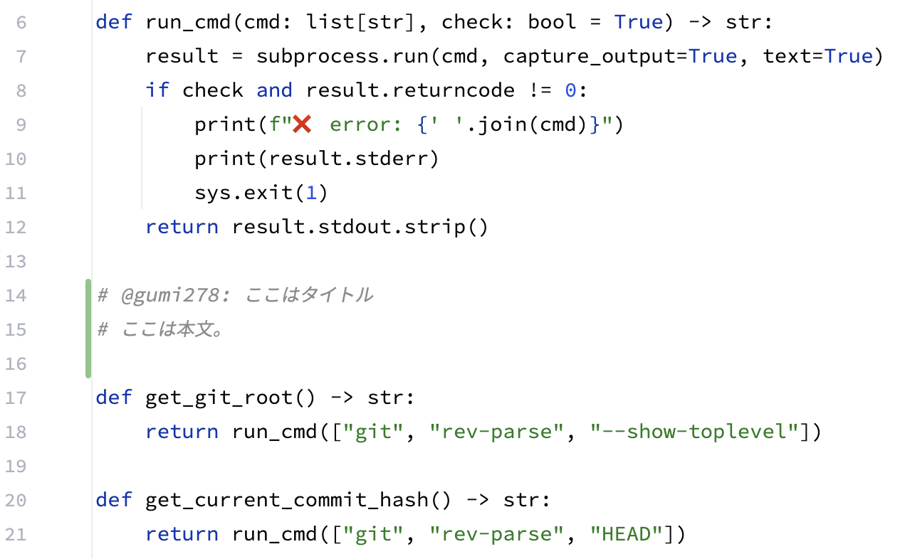
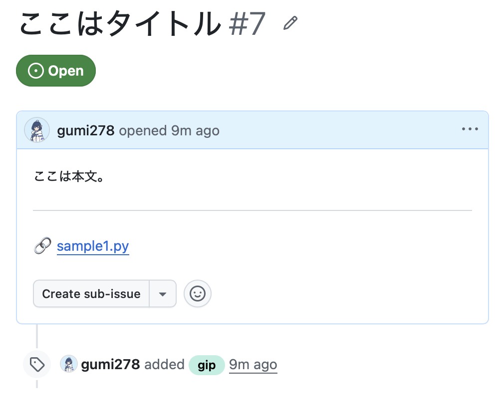

# git-intent-picker (gip)

[English](README.md) | [日本語](README.ja.md)

ソースコードに書き込んだ「マーカーコメント」を拾ってくるCLIツールです。

AI駆動開発（AIエージェントによる自動実装など）において、「AIが生成した純粋なコード」と「人間が熟考した設計意図」を分離し、コミット履歴をクリーンに保つための「意図のサイドカー（Sidecar）」として機能します。

現時点の実装は、Pythonコードに記述したマーカーコメントを抽出し、GitHubへ半自動的にIssue化する挙動となっています。

## ✨ 特徴

* **安全なRead-Only設計**: ファイルを自動で削除・復元（`git restore`）するような破壊的変更は一切行いません。抽出後は、IDEのRollback機能を使って、視覚的かつ安全にクリーンアップできます。
* **1意図 = 1 Issue**: 抽出されたマーカーコメントのブロックごとに、独立したGitHub Issueを自動で起票します。
* **クリーンなテキスト出力**: `gh` コマンドを通じて起票されるIssueは、Pythonのコメント記号（`#`）や不要なインデントが取り除かれたプレーンテキストとして記録されます。
* **HEADコミットの自動紐付け**: 現在のHEAD（確定済みの最新コミット）のハッシュを取得し、Issue本文に対象ファイルへのパーマリンクとして自動的に刻印します（誤解を防ぐため、あえて行番号指定は行いません）。
* **タイトルの自動生成**: マーカーコメントの1行目からプレフィックスを取り除き、自動的にIssueのタイトルを生成します。




## 📦 前提条件

このツールは以下のコマンドと設定に依存しています。

* Python 3.x
* Git
* GitHub CLI (`gh`) ※事前に `gh auth login` で認証を済ませてください。
* **【重要】GitHubリポジトリの設定**: 本ツールは作成するIssueに自動で `gip` というラベルを付与します。**事前にGitHubリポジトリ上で `gip` という名前のラベルを作成しておいてください。**（ラベルが存在しないとエラーで処理が中断します）。

## 🚀 インストール

ソースコードは `src/gip/main.py` に配置されています。
ターミナルで `gip` として実行できるよう、エイリアスを設定することをおすすめします。

```bash
# ~/.zshrc や ~/.bashrc に以下を追記
alias gip='python3 /絶対パス/src/gip/main.py'
```

## 💻 使い方

### 1. マーカーコメントの書き方

作業ツリー（未コミット状態）の `.py` ファイルに、特定のプレフィックス（`# @あなたの名前`）で始まるコメントを記述します。

* 必ず行の1文字目を `#` で始めてください（左側にインデントがあっても構いません）。
* プレフィックスに使用する「名前」は、`git config user.name` の設定値と合わせることを推奨します（コマンド実行時のオプション指定が不要になるため）。
* 名前の直後は空白、コロン（`:`）、または改行にしてください（誤検知防止のため）。

```python
    def calculate_total():
        # @taro: 依存関係の注入について
        # ここでは外部APIを直接叩かず、DIを用いて
        # テスト容易性を担保する設計にしました。
        pass
```

### 1.1 勘違いしやすいポイント

* **マーカーコメントのブロックは、行コメントが途切れるまでです**
  途中で空行が入ったり、複数行文字列（`"""` によるdocstringなど）のような書き方には対応していません。連続する行コメント（`#`）が途切れた箇所までを、ひとつのマーカーコメントのブロックとして機械的に認識します。

* **コマンド実行の位置が重要です**
  ローカルのGitリポジトリの `diff` を使い、HEADとの差異があるファイルを走査する仕組みです。そのため、**必ず対象となるGitリポジトリ配下のディレクトリに移動してから実行してください**。GitHub IssueへのアクセスはGit関連の設定（`git` および `gh`）から取得して使用します。

* **未コミットの変更にしか反応しません**
  `git diff` を使った差異をトリガーとするため、**変更をコミットしてHEADとの差異がない状態になると、マーカーコメントを書いても反応しません**。

* **Pythonコードにしか反応しません**
  マーカーコメントの取り扱いを多言語展開すると複雑になるため、現在はPythonファイル（`.py`）限定としています。今後、他言語へ対応する可能性があります。

* **マーカーコメントを含んだままコミットすると、少しややこしくなります**
  本ツールは「未コミットの差分」からマーカーコメントを抽出します。そのため、`gip` を実行する前にマーカーコメントごとコミットしてしまうと、差分として認識されず抽出できなくなります。
  もし後から `gip` でIssue化したくなった場合、「一度マーカーコメントを消してコミットし直す（ハッシュを確定）」➔「再度マーカーコメントを付与してから `gip` を実行する」という手間が発生し、Issueに刻まれるハッシュと実際のコミットのハッシュもズレてしまいます。
  なお、Issue化せずにそのまま履歴に残した場合、AIエージェントが次にコードを編集する際にそのマーカーコメントを目にする可能性はありますが、致命的な問題に発展することはほぼありません（Issue化せず、単なるメモとして残すだけであればそのままでも問題ありません）。

### 2. コマンドの実行

ターミナルから以下のコマンドを実行します。デフォルトでは、Gitの設定（`git config user.name`）から自動的に名前を取得して抽出対象とします。

```bash
gip
```

もしGitの設定とは異なる名前で抽出したい場合は、`--author` オプションで明示的に指定することも可能です。

```bash
gip --author "taro"
```

## 🔄 理想的なワークフロー

`git-intent-picker` を用いた、コードと意図を分離するトランザクションの流れです。

1. **AIのコードをコミット (HEAD確定)**
   実装が終わった純粋なコードをコミットし、ハッシュを確定させます。（例: `git commit -m "feat: implement logic"`）

2. **意図の記述 (未コミット)**
   IDE上で、対象の `.py` ファイルに `# @名前:` で意図（マーカーコメント）を書き込みます。（※この時点ではコミットしません。他のMarkdownなどのドキュメント修正を並行して行っても問題ありません。）

3. **抽出と起票**
   `gip` を実行します。マーカーコメントのブロックが抽出され、現在のHEADハッシュと共にGitHub Issueが作成されます。

4. **IDEで視覚的にRollback**
   実行後、ターミナルの指示に従い、IntelliJなどのIDEに戻ります。不要になったマーカーコメントの差分だけをエディタ上で「Rollback（変更を元に戻す）」して消去します。
   *(このまま次のAIエージェントによる編集作業に移ると、AIエージェントが文脈を読んで勝手に消してくれることもあります。)*

5. **残りの作業をコミット＆Push**
   残しておいたドキュメント（`.md`）などの修正を別コミットとし、任意のタイミングでリモートへ `git push` します。

## ⚙️ 制限事項

* 現在のバージョンでは、抽出対象のファイルは `.py` 拡張子のファイルのみに限定されています。

---

## ライセンス (License)

本プロジェクトは [MIT License](./LICENSE) のもとで公開されています。