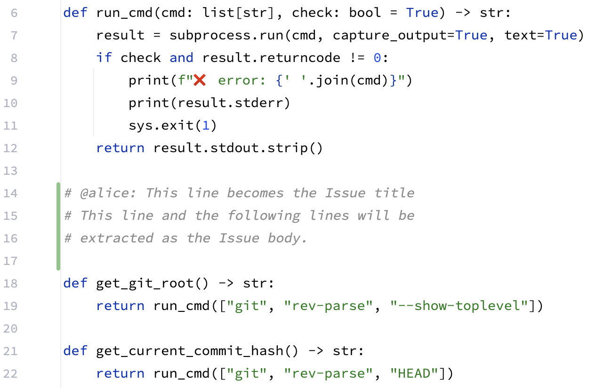
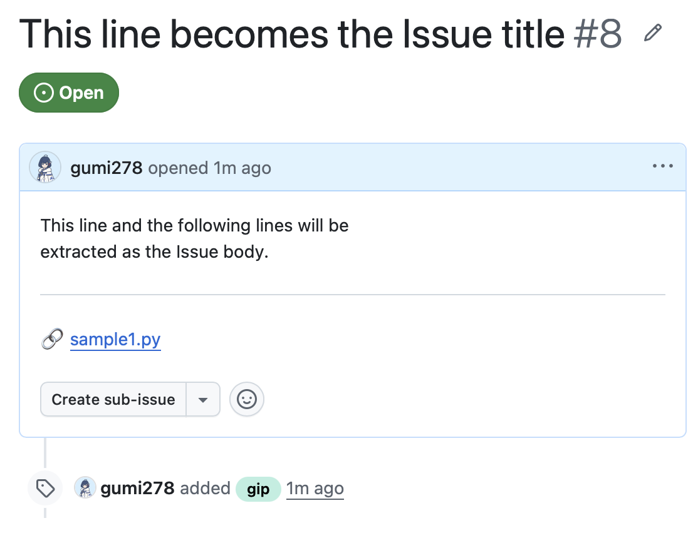

# git-intent-picker (gip)

[English](README.md) | [日本語](README.ja.md)

A CLI tool that picks up "marker comments" written directly in your source code.

In the era of AI-driven development (e.g., auto-implementation by AI agents), this tool acts as an "Intent Sidecar." It strictly separates "pure code generated by AI" from "deliberate human design intent," keeping your Git commit history perfectly clean.

Currently, this tool extracts marker comments written in Python code and semi-automatically converts them into GitHub Issues.

## ✨ Features

* **Safe Read-Only Design**: No destructive operations like auto-deleting or restoring (`git restore`). After extraction, you can safely and visually clean up the comments using your IDE's Rollback feature.
* **1 Intent = 1 Issue**: Automatically creates an independent GitHub Issue for each extracted marker comment block.
* **Clean Text Output**: The created Issues are stripped of Python comment symbols (`#`) and unnecessary indentations, rendering as clean plain text.
* **Auto-Link HEAD Commit**: Fetches the current HEAD hash (the latest confirmed commit) and embeds it as a permalink to the target file within the Issue body (intentionally omitting line numbers to prevent confusion, as the comments will be rolled back).
* **Auto-Generated Titles**: Automatically generates the Issue title by stripping the prefix from the first line of the marker comment.




## 📦 Prerequisites

This tool depends on the following commands and configurations:

* Python 3.x
* Git
* GitHub CLI (`gh`) *Note: Please authenticate in advance using `gh auth login`.*
* **[CRITICAL] GitHub Repository Setup**: This tool automatically applies a label named `gip` to the created Issues. **You must manually create the `gip` label in your GitHub repository beforehand.** (The process will fail with an error if the label does not exist).

## 🚀 Installation

The source code is located at `src/gip/main.py`.
We recommend setting up an alias so you can run it globally via the `gip` command.

```bash
# Add this to your ~/.zshrc or ~/.bashrc
alias gip='python3 /absolute/path/to/src/gip/main.py'
```

## 💻 Usage

### 1. Writing Marker Comments

In your `.py` files inside the working tree (uncommitted state), write comments starting with a specific prefix (`# @yourname`).

* The very first character of the line must be `#` (left indentation is allowed).
* We highly recommend matching the "name" in your prefix with your `git config user.name` (this allows you to run the command without specifying options).
* Immediately following the name, use a space, a colon (`:`), or a newline to prevent false positives.

```python
    def calculate_total():
        # @alice: About Dependency Injection
        # We designed this using DI instead of calling the external API directly
        # to ensure testability.
        pass
```

### 1.1 Common Pitfalls

* **A marker comment block ends when the line comments break.**
  The parser cannot handle empty lines in between or multi-line string formats (like docstrings using `"""`). It mechanically recognizes contiguous line comments (`#`) as a single block.

* **Execution directory matters.**
  The tool uses the local Git repository's `diff` to scan files that differ from HEAD. Therefore, **you must execute the command inside the target Git repository**. It fetches GitHub Issue access configurations from Git-related settings (`git` and `gh`).

* **It only reacts to uncommitted changes.**
  Because it triggers based on `git diff`, **if you commit the changes and there is no diff against HEAD, writing marker comments will yield no reaction**.

* **It currently only works with Python code.**
  To avoid complexity in handling marker comments across multiple languages, the parser is currently limited to Python (`.py`) files. Multi-language support may be added in the future.

* **Committing with marker comments complicates the workflow.**
  This tool extracts marker comments from "uncommitted diffs." If you commit the marker comments before running `gip`, they will no longer be recognized as diffs and cannot be extracted.
  If you decide you want to create an Issue *after* committing, you will have to undergo a tedious process: "remove the marker comments and re-commit (to finalize the pure code hash)" ➔ "re-add the marker comments and run `gip` again." This creates unnecessary friction and misaligns the hash recorded in the Issue with the actual commit hash.
  *Note: If you leave them in the history without turning them into Issues, an AI agent might see the comments the next time it edits the code, but this rarely leads to fatal problems. (If you just want to leave a memo and don't need an Issue, committing them as-is is perfectly fine).*

### 2. Running the Command

Run the following command in your terminal. By default, it automatically retrieves the target name from your Git configuration (`git config user.name`).

```bash
gip
```

If you want to extract comments using a name different from your Git setting, you can explicitly specify it with the `--author` option.

```bash
gip --author "alice"
```

## 🔄 The Ideal Workflow

Here is the ideal transaction flow for separating code and intent using `git-intent-picker`:

1. **Commit the AI's Code (Confirm HEAD)**
   Commit the pure, completed code to confirm the hash. (e.g., `git commit -m "feat: implement logic"`)

2. **Describe Intent (Uncommitted)**
   In your IDE, write your intent (marker comments) using `# @Name:` in the target `.py` file. *(Do not commit at this point. It is perfectly fine to modify other documents like Markdown files concurrently).*

3. **Extract and Publish**
   Run `gip`. The marker comment blocks are extracted, and GitHub Issues are created along with the current HEAD hash.

4. **Visually Rollback in IDE**
   After execution, return to your IDE (like IntelliJ) as instructed in the terminal. Use the "Rollback" feature directly in the editor to safely erase only the diffs of the no-longer-needed marker comments.
   *(Alternatively, if you proceed to the next AI editing task, the AI agent might read the context and remove them for you).*

5. **Commit & Push the Remaining Work**
   Commit any remaining modifications, such as documents (`.md`), as a separate commit, and `git push` to the remote at your convenience.

## ⚙️️ Limitations

* In the current version, extraction is strictly limited to `.py` files.

---

## License

This project is licensed under the [MIT License](./LICENSE).

