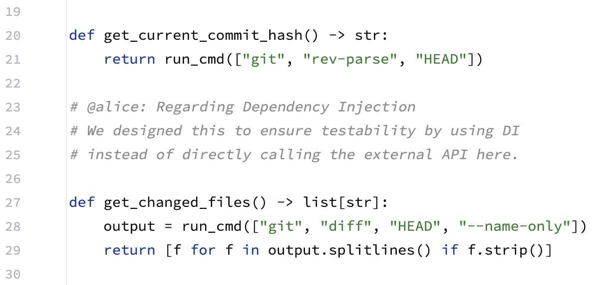
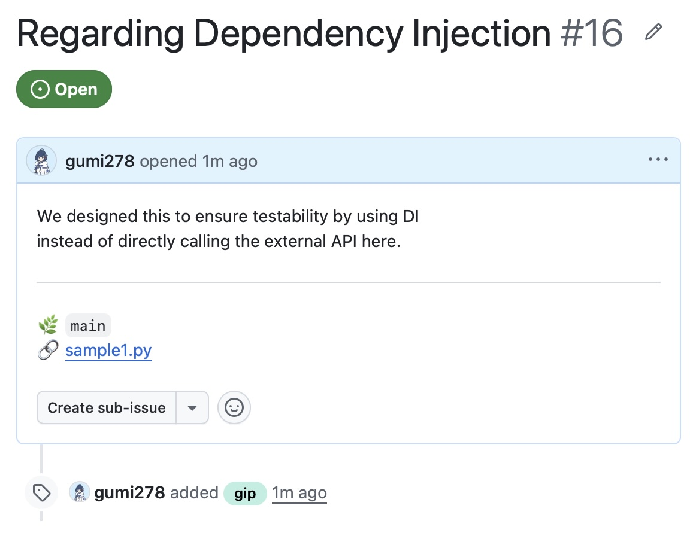
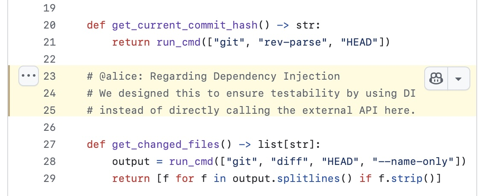

# git-intent-picker (gip)

[English](README.md) | [日本語](README.ja.md)

A CLI tool that extracts "marker comments" embedded in your source code.

In modern AI-driven development (e.g., using AI agents for automated coding), this tool acts as an **Intent Sidecar**. It helps separate pure AI-generated code from human-crafted design intent, keeping your commit history clean and meaningful.

Currently, it extracts marker comments written in Python and semi-automatically converts them into GitHub Issues.





## ✨ Features

* **Safe & Read-Only**: Makes zero destructive changes (no automatic `git restore` or file deletion). You maintain full control over when to commit the cleanup.
* **1 Intent = 1 Issue**: Automatically creates a dedicated GitHub Issue for each extracted marker comment block.
* **Clean Text Output**: Strips Python comment symbols (`#`) and unnecessary indentation, recording the Issue in clean, plain text via the `gh` CLI.
* **Perfect HEAD Commit Linking**: Analyzes the latest commit (HEAD) to stamp a permanent, line-accurate link (e.g., `#L12-L15`) directly in the Issue body.
* **Smart Title Generation**: Automatically generates the Issue title by parsing the first line of your marker comment.

## 📦 Prerequisites

This tool requires the following:

* Python 3.x
* Git
* GitHub CLI (`gh`) — *Make sure to authenticate first using `gh auth login`.*
* **[IMPORTANT] GitHub Repository Label**: The tool automatically tags created issues with the `gip` label. **You must create a `gip` label in your GitHub repository beforehand.** (The command will fail if the label does not exist).

## 🚀 Installation

For macOS and Linux, we recommend installing via our custom Homebrew Tap. Dependencies (`gh` and `python3`) will be resolved automatically.

```bash
brew install gumi278/tap/gip
```

Once installed, the `gip` command is available globally (*Note: `gh auth login` is required prior to use*).

### Getting the Latest Version (Manual Installation)

If you prefer the bleeding-edge version or don't use Homebrew, you can clone the repository and run it locally.
The entry point is `src/gip/main.py`.

```bash
git clone https://github.com/gumi278/git-intent-picker.git

# Example usage:
# python3 git-intent-picker/src/gip/main.py
```

## 💻 Usage

### 1. Writing Marker Comments

In your working tree, write a comment starting with the prefix `# @yourname` in a `.py` file and **commit it**.

* The line must start with a `#` (leading indentation is fine).
* We highly recommend matching the "name" in the prefix with your `git config user.name` (this saves you from passing it as a CLI argument).
* Follow the name immediately with a space, a colon (`:`), or a newline to prevent false positives.

```python
    def calculate_total():
        # @alice: Regarding Dependency Injection
        # We designed this to ensure testability by using DI
        # instead of directly calling the external API here.
        pass
```

### 1.1 Common Pitfalls

* **It only reacts to the latest commit (HEAD)**
  
  `gip` uses `git diff HEAD~1 HEAD` to find lines added or changed in the most recent commit. **Existing marker comments from older commits will not be extracted.** 
  *(To re-issue an old marker comment, you must edit or append to it to create a new diff).*

* **A block ends when the comments break**

  It does not support blank lines or multi-line strings (like `"""` docstrings) within a block. The tool mechanically treats contiguous line comments (`#`) as a single block until the sequence breaks.

* **Issue permalinks will 404 until pushed**

  `gip` generates permalinks using your local HEAD commit hash. Therefore, links in newly created Issues will result in a "404 Not Found" until you push that commit to GitHub.

* **Python only (for now)**

  To avoid complexity, marker extraction is currently limited to Python (`.py`) files. Multi-language support may be added in the future.

* **Execution context matters**

  Make sure you run the command inside the target Git repository directory, as it relies on your local environment and Git configurations to access GitHub.

### 2. Executing the Command

After committing your code with marker comments, run the following command.
By default, it will automatically pull your target name from your Git config (`git config user.name`).

```bash
gip
```

To extract comments for a different author name, use the `--author` flag:

```bash
gip --author "alice"
```

### 3. Routing Issues to a Specific Remote

If you are working on a fork (`origin`) but want to file Issues upstream, you can route the destination by setting the `GIP_ISSUE_REMOTE` environment variable.

```bash
export GIP_ISSUE_REMOTE=upstream
```

* **Default behavior:** If left undefined or empty, it defaults to `origin`.
* **Cross-repo safe:** Code permalinks are strictly generated using the `origin` URL (where your code physically lives), guaranteeing that links won't break even when issues are filed in a different repository.
* **Best practice:** We highly recommend using tools like `direnv` to declare this per-project inside an `.envrc` file.

## 🔄 The Ideal Workflow

Here is the most seamless and natural workflow for separating code from intent using `git-intent-picker`:

1. **Write Code & Intent -> Commit (Finalize HEAD)**

  In your IDE, write your implementation along with your intent (marker comments) using `# @name:`, and commit them together.
  (e.g., `git commit -m "feat: implement logic with intent"`)

2. **Extract & Create Issues**

  Run `gip`. Marker comments are extracted from the latest commit diff, automatically creating GitHub Issues with perfect permalinks (using the finalized commit hash and exact line numbers).

3. **Push to Remote (Enable Links)**

  Run `git push`. This pushes your commit to the remote repository, instantly validating the permalinks in your new Issues.

4. **Clean up Intents (Detach the Sidecar)**

  Once the Issues are created, the inline marker comments are no longer needed. Delete them in your IDE and commit the cleanup as a separate step.
  (e.g., `git commit -m "remove: gip marker comments"`)
  *(You can do this manually, or let an AI agent naturally delete them during its next coding iteration).*

This workflow guarantees a permanent snapshot of your design intent as a GitHub Issue while keeping your future codebase and commit history completely free of comment noise.

## ⚙️ Limitations

* Currently, the extraction target is strictly limited to files with the `.py` extension.

## License

This project is published under the [MIT License](./LICENSE).
